# Computer vision

One of the focus of the Future Engineers competition is to allow students to learn how to use computer vision for solving practical problems.

_Computer vision is an interdisciplinary scientific field that deals with how computers can gain high-level understanding from digital images or videos. From the perspective of engineering, it seeks to understand and automate tasks that the human visual system can do._

This definition is picked up from [Wikipedia](https://en.wikipedia.org/wiki/Computer_vision){target=_blank}

Although the overall trend in the modern information technologies is to use the computer vision together [the machine learning](https://en.wikipedia.org/wiki/Machine_learning){target=_blank} approaches that also include [deep learning](https://en.wikipedia.org/wiki/Deep_learning){target=_blank}, the Future Engineers competition does not require to be getting familiar with them. Below you can find clarifications why it is so. 

## Physical considerations

Before writing a line of the code for the computer vision implementation, think:

  - what resolution of the camera is suitable for the vehicle
  - how must the camera be directed to solve the task more efficiently
  - whether it is necessary to mount another lens before the camera's image plane

### Camera resolution

The camera resolution determines how many pixels is in the frame received from the camera. Usually it is specified as the amount of pixels in the row and the number of rows. For example, 640 x 480 says that each frame will contain 480 rows as so every row consists of 640 pixels. Totally it will be 307200 pixels in the frame.

This could bring you to understanding that higher resolution frames (e.g. standard HD, 720p that is 1280 x 720) contains more pixels than a low resolution frames. So, it is logically that more time is required to transfer these pixels and process them by an image processing algorithm. If your CPU is not so powerful, you would prefer to use cameras with lower resolution or configure a high resolution camera to work in low resolution mode.

The rate how fast your algorithm is able to receive and process the frames from camera is characterized by the metric called FPS - frames per second. The value of this metric is very important for the autonomous vehicles: the higher value allows to perceive the road conditions more frequently. So, the response on a sudden change of the conditions (e.g. a new object appears in the camera's field of view) will be shorter. For the conditions like we have on the Future Engineers challenge the higher FPS value allows to increase the speed of the vehicle.

The opposite side of cameras with a low resolution is a larger size of the objects that can be distinguished on the resulting frame. Consider the following examples: the first image was made with the resolution 640x480, the second image was with the resolution 160x120.

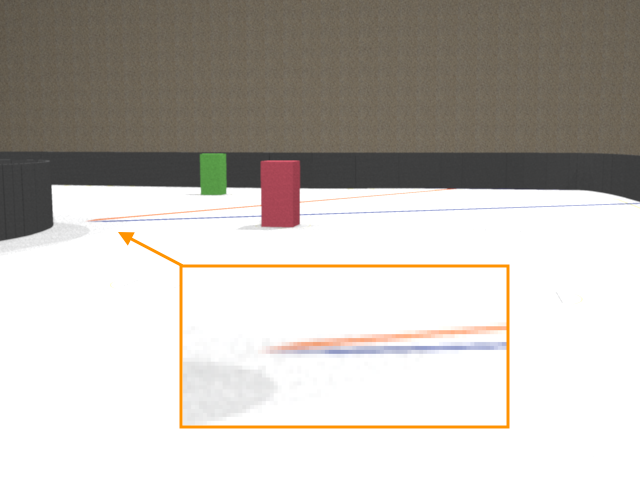

Although the images were made from the same camera position and for the same angle of view, it is clear that the thickness of the blue and orange lines is not enough to recognize them on the second image.

### Point of view

The direction how the camera is fixed on the vehicle determines which objects will appear in the image frame. Obviously, that in order to simplify the image processing we would like to get rid of the elements that are behind of the game field walls like like judges or spectaculars.

Here, the camera is fixed on the height of 100 mm and [the pitch](https://en.wikipedia.org/wiki/Aircraft_principal_axes){target=_blank} of the sensor plane is 10 degrees.

_Static image:_

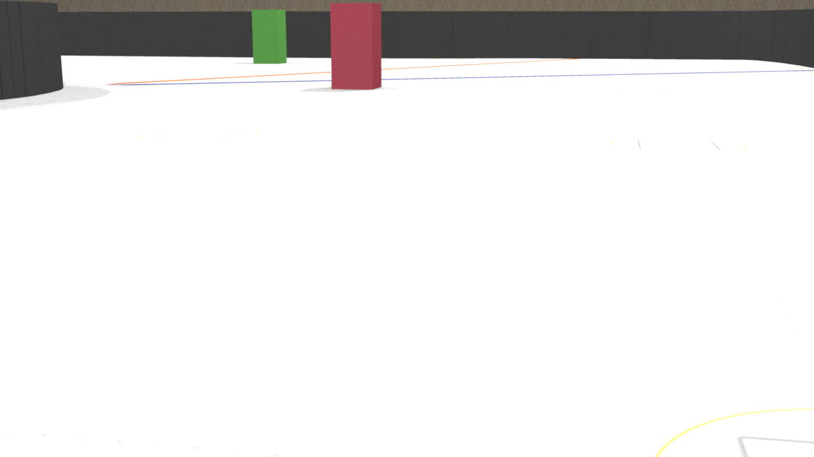

_Video stream:_

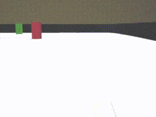

As you can see on the static image the top edge of the exterior wall is located as so the camera almost does not perceive elements outside of the wall. The video stream is taken with another resolution, that's why the camera gets more information that does not belong to the game field. But pay attention on the average level of the wall's top edge - it does not change when the vehicle is moving, so [ROI (region of interest)](https://www.stemmer-imaging.com/en-se/knowledge-base/region-of-interest-roi/){target=_blank} will help limit the area for the image processing.

From other side, the game objects that are in the the frame must not interfere each other. On the picture above the red and green cubes are almost on the same level, that's why, since the vehicle needs to turn left for the green cube and turn right for the right cube, it could be hard to make a decision which direction to choose. In order to get rid of this ambiguity the camera can be fixed on a higher position and/or the pitch could be increased.

These samples are for the camera fixed on the height of 175 mm and and the pitch of the sensor plane is 14 degrees.

_Static image:_

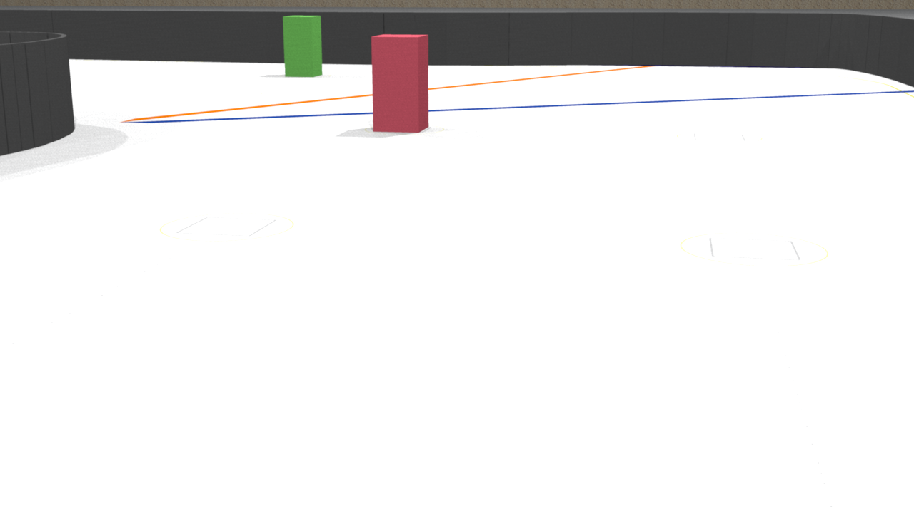

_Video stream:_

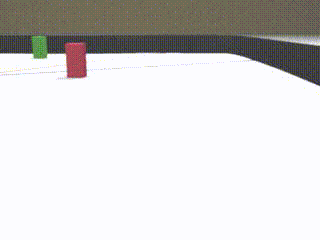

Another pair of samples is for the camera fixed on the height of 280 mm and and the pitch of the sensor plane is 17 degrees.

_Static image:_

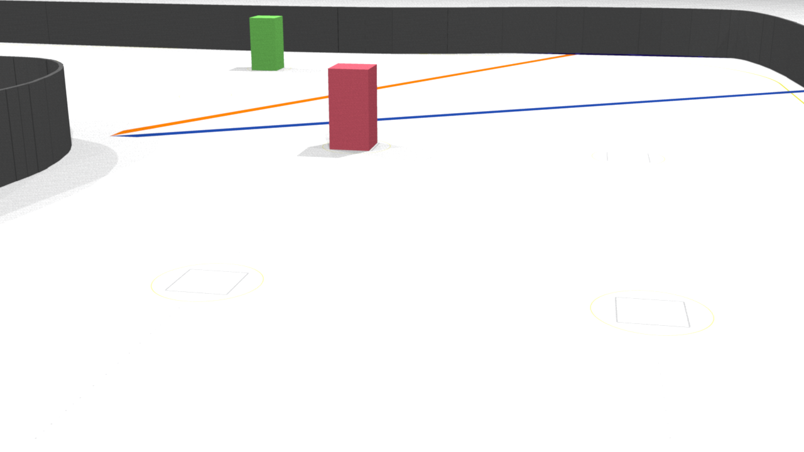

_Video stream:_

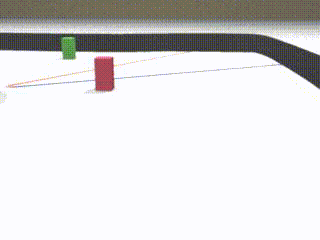

Please note, although the top edge of the exterior wall is located as so the frame does not contain any object outside the game field, the scene changes in the dynamic (on the video streams) represents that it could be hard to specify such ROI when that will reduce number of unnecessary elements but will allow to have early detection of the colored cube at the same time (earlier detection of the element simplifies the motion planning for the robot).

### Lens

One could find that the lens the camera is equipped by default are not suitable for the particular task. 

This is a list of possible issues with the default lens:
  - [depth of field](https://en.wikipedia.org/wiki/Depth_of_field){target=_blank} is to small so the objects distanced from the camera's image plane are too blurred.
  - the light intensity delivered by the lens to the camera's sensor is not enough so the resulting image is too dark or too noisy
  - the physical mount of the lens is not rigid as so the camera is unfocused when the vehicle is moving

Another possible case that needs to be consider to choose other lens is that by using [wide-angle lens](https://en.wikipedia.org/wiki/Wide-angle_lens){target=_blank} the amount of useful information delivered to the camera's sensor can be increased without changing the point of view.

Look at the following video streams:

_The angle of view is 45 degrees:_

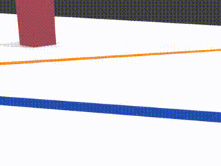

_The angle of view is 120 degrees:_

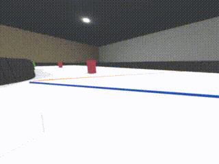

In both cases the vehicle drove almost the same path, the camera was fixed on the height 100mm and the pitch was 17 mm, but you can see that in the second case the camera perceives more information so the algorithm could discover the walls, perform early detection of the colored cube and track the cube until it is fully passed.

## Objects recognition

A convenient way for beginners to start getting familiar with the computer vision approaches is to work with [the OpenCV library](https://en.wikipedia.org/wiki/OpenCV){target=_blank}. This library has bindings for almost all popular programming languages.

Those who use Python and don't familiar with the OpenCV can learn essentials of the library through [the official tutorials](https://docs.opencv.org/master/d6/d00/tutorial_py_root.html){target=_blank}.  

Below it will be presented a general pipeline that can be implemented as a base of the algorithm for participation in the Future Engineers competition.

### Region of interest

Consider that there is a following image of two objects: red and green cubes:

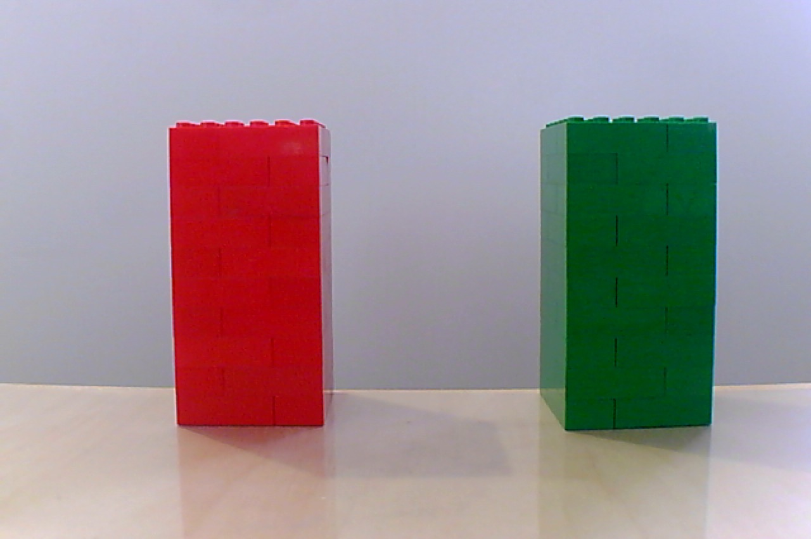

Imagine the situation when we know in advance a distance which the object should be recognized on. If the object is located on the same plane where the vehicle is moving upon, it means that the bottom edge of the object's shape on the image could be expected approximately on the same rows of pixels.

Bases on this fact, we can choose a region of the image to work only with it further. Since the region is less than entire image, the next image processing and an object detection will be performed faster.

_Cropped image:_

Basic OpenCV operations with images are covered in [this tutorial](https://docs.opencv.org/master/d3/df2/tutorial_py_basic_ops.html){target=_blank}.

### Image de-nosing

Even if on the image above one object looks red and another one looks green, a small zoom will demonstrate that the colors are not uniform (especially on the green object).

_Red cube:_

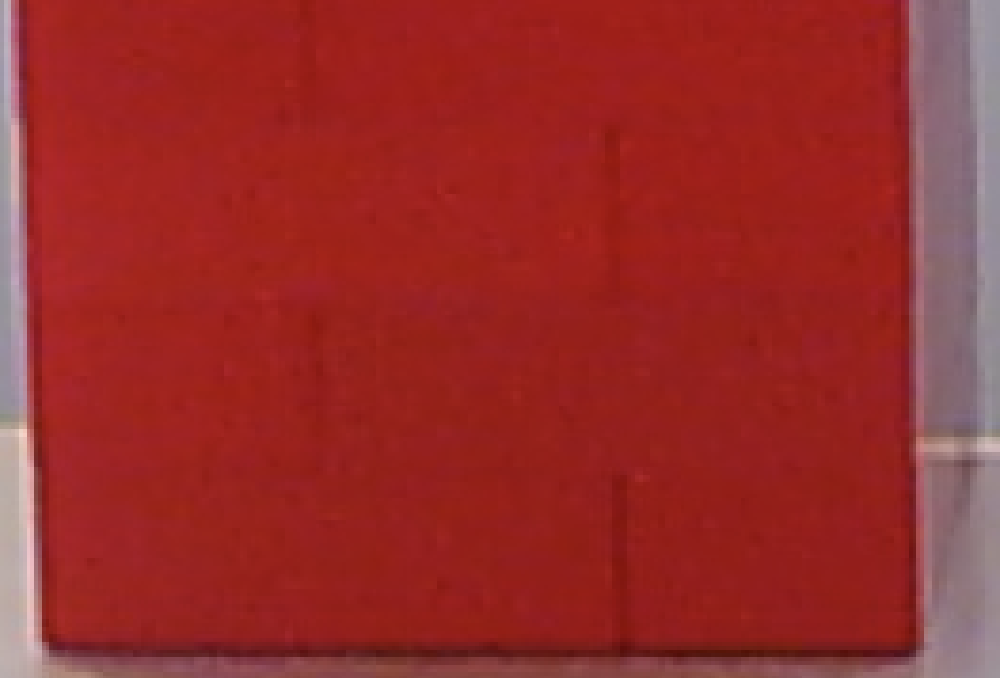

_Green cube:_

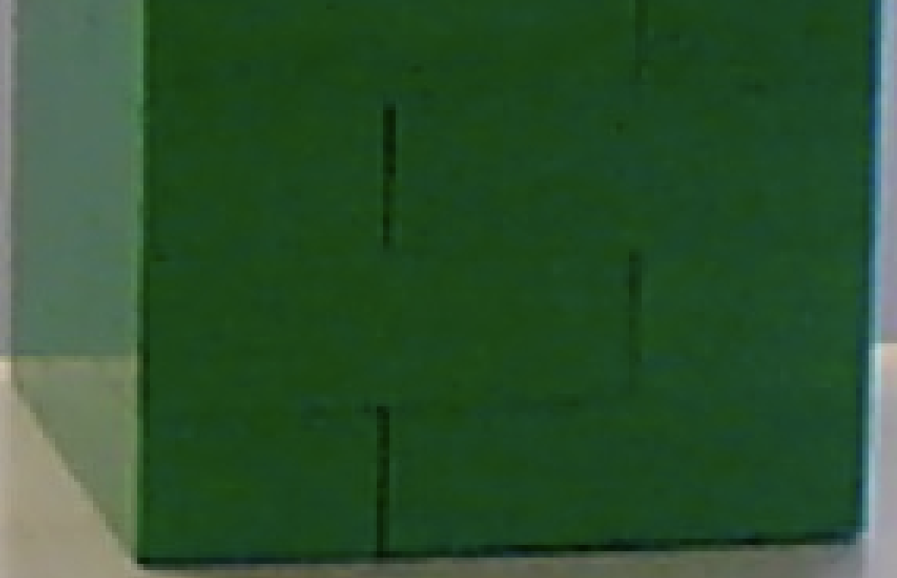

Bearing in mind that the color on the digital images is represented by a set of numbers, if we specify some specific color we cannot expect that a) either this color exists on the image at all; b) or we can find enough amount of pixels of this color to say for sure that there is an object of this color on the image.

That's why usually the images are smoothed to reduce gradations of the same color. The same process is used in the digital photography to reduce amount of digital noise on the image.

_Smoothed image:_

How to implement smoothing with OpenCV can be read [here](https://docs.opencv.org/master/d4/d13/tutorial_py_filtering.html){target=_blank}.

### Thresholding

Thresholding is a way to find such pixels on an image that correspond some properties. Depending on the color scheme used to encode the image the property of the pixel can be its color. 

For example, the widely used RGB color scheme allows to say how much red, green or blue component is contained in a pixel. The completely white pixel contains maximum of red, green and blue colors. The completely black pixel contains no red, green and blue colors at all.

So, someone could assume that if we need to discover a red object on the image, we need to look at the red component of each pixel and if it is maximum the pixel is belonged to a red object. But it is not true.

Let's look on the red components of the pixels in the image:

Here the most bright pixels correspond to the maximum of the red component. As you can see lots of pixels have maximum in th red component. Why? Recall that the red component of a white pixel is the highest possible.

In fact, it is more logical to look at the pixels where the red component is maximum and the blue and green components are on the lowest values. 

_Green component:_

_Blue component:_

But this leads to nontrivial logic to implement threshold which will become even more complicated if the light condition are being changed.

That is why it makes sense to use another color scheme which is more suitable for color recognition. This scheme is called [HSV (Hue+Saturation+Value)](https://en.wikipedia.org/wiki/HSL_and_HSV){target=_blank}. The color of the pixel is encoded by the Hue component. The changing light conditions will not affect the Hue component but are reflected in the Saturation and Value components.

Here is how the image looks like if HSV components are separated (the most bright pixels correspond to the highest value of the component):

_Hue component:_

_Saturation component:_

_Value component:_

So if we know the range that corresponds to some color in the Hue component we can filter out all pixels within this range.

The OpenCV library allows to generate a binary representation of the image where the black pixels correspond to the original image's pixels that are outside of the range. This representation is also called the "mask".

_The mask for the red object:_

_The mask for the green object:_

The example of the filtering out the pixels in the HSV color scheme can be found in [this article](https://docs.opencv.org/master/df/d9d/tutorial_py_colorspaces.html){target=_blank}.

### Center of an object (centroid)

OpenCV Contours: https://docs.opencv.org/master/d3/d05/tutorial_py_table_of_contents_contours.html

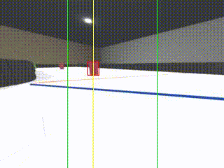
